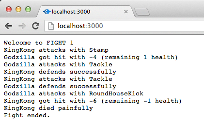
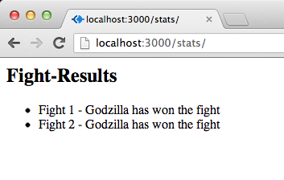
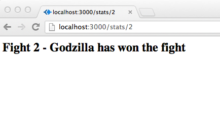

<small>Web-Entwicklung mit node.js</small> 
<small>Hochschule Augsburg</small> 
<small>SS 2013</small>

## Aufgabe 3

Zu guter Letzt möchten die Monster noch dieses sogenannte Web erobern, von dem man neuerdings so viel hört...

---

**a)** Erstelle einen Webserver, der den Kampf "live" an alle Fans streamed

- bei jedem Request an **/**, also __http://localhost:3000__ soll ein neuer Kampf gestartet werden
- die Ausgabe soll dabei direkt an die Response gestreamed werden, so dass die Ausgabe Stück für Stück erfolgt
- bei Streams müsst ihr mit dem ContentType "text/json" arbeiten `res.setHeader('Content-Type', 'text/json');`

__Struktur__
- **/monsterServer.js** - der Webserver
- **/package.json** definiert das monsterServer-Modul
- **/node_modules** beinhaltet monsterFight Modul der letzten Aufgaben und express

__Referee__
- das __monsters__ Modul wurde upgedated und der Referee emitted jetzt folgende Events
 - moderation(text)
 - end(result) z.b. result = "DRAW! Both monsters seem to be very strong."
 - round(roundCnt)
- bitte aktualisiert __euer__ monsters Modul mit dem neuen  [Referee](Referee.js) 

---

**b)** Statistiken über die letzen Kämpfe

Der Webserver soll um zwei Routen ergänzt werden um Statistiken zu den letzten Kämpfen an die begeisterten Fans zu liefern

- der Webserver soll sich merken wie viele Kämpfe bereits ausgetragen wurde und wer jeweils gewonnen hat
- **/stats/** soll eine Liste der letzten Ergebnisse ausgeben 

- **/stats/:round** soll die Ergebnisse der Kampfrunde (:round) ausgeben

---

*Bei Fragen und Problemen helfen wir gerne weiter*
